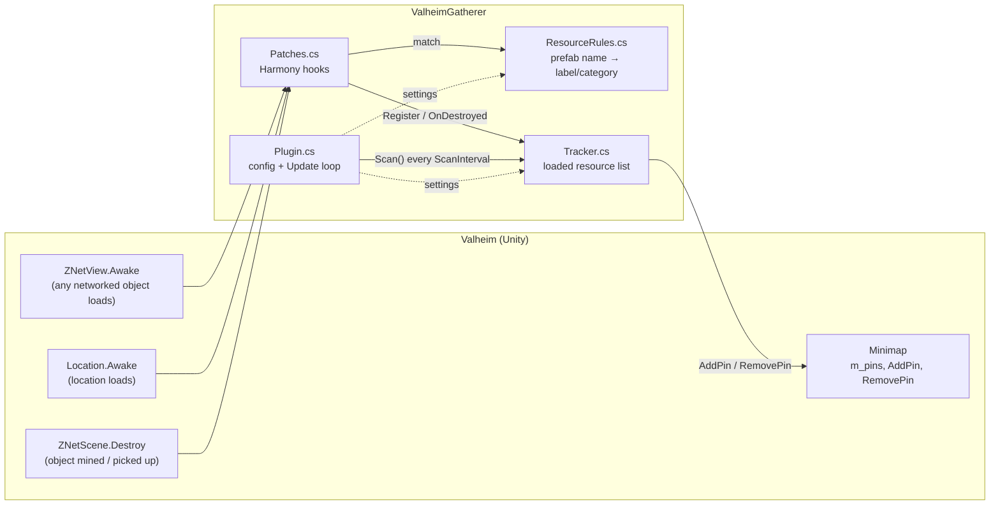

# Architecture

This document describes how Valheim Gatherer is structured and records the design decisions made along the way. When a decision changes, add a new entry to the log and mark the old one as superseded. Don't delete old entries.

## Overview

### Components

| File | Responsibility |
| --- | --- |
| `Plugin.cs` | BepInEx entry point. Binds config (general settings, rules, and the settings for each category), applies the Harmony patches, and calls `Tracker.Scan()` on a timer from `Update`. |
| `ResourceRules.cs` | Default rule table and custom/disabled rule parsing. Matches prefab names case-insensitively by prefix, and the longest prefix wins. Caches results by prefab hash. |
| `Tracker.cs` | Holds the currently loaded resource objects. `Scan()` pins those within range of the local player. `OnDestroyed()` removes a pin when the last object it covers is gone. |
| `Patches.cs` | Harmony hooks that pass game objects to the rules and the tracker. |

### Lifecycle of a pin

1. **Load.** A zone loads and `ZNetView.Awake` runs for each networked object. The postfix looks up the object's prefab hash in `ResourceRules`, and matching objects are registered in `Tracker`. `Location.Awake` does the same for locations and for the runestones and vegvisirs inside them.
2. **Discover.** Every `ScanInterval` seconds, `Tracker.Scan()` measures the 3D distance from the local player to each unhandled entry. Entries within `DiscoveryRadius` are marked handled.
3. **Filter.** The pin is skipped if the category is disabled, if the object is inside a player base, or if a pin with the same label already exists within `MergeRadius`.
4. **Pin.** `Minimap.AddPin(pos, icon, label, save: true, ...)` creates a normal saved pin that the player can edit or delete.
5. **Deplete.** When the game destroys the object (`ZNetScene.Destroy`), the prefix removes the entry. If the category has `RemoveWhenDepleted` and no other loaded object with the same label is within `MergeRadius` of the pin, the pin is removed.
6. **Unload.** When a zone unloads, its objects become Unity-null and are pruned on the next scan. The pins stay.

### Build setup

- The project targets `net48` and uses the `Microsoft.NETFramework.ReferenceAssemblies` package, so it builds with the plain .NET SDK.
- It references the game and BepInEx DLLs from the local install with `Private=false`, so nothing is copied or redistributed.
- Paths come from `Local.props`, which is gitignored. `Local.props.example` is the committed template.
- The optional `DeployToPlugins` target copies the DLL into `BepInEx/plugins/ValheimGatherer/`.

## Decision log

### 2026-10-06: Initial implementation

**D1. Use BepInEx 5 with Harmony, client-side only.**
BepInEx is the standard Valheim mod loader, and both mod managers support it. Pins are stored per player in the character profile, so no server component is needed. `[BepInProcess("valheim.exe")]` stops the plugin from loading on dedicated servers.

**D2. Discover objects by hooking `ZNetView.Awake` instead of polling the scene.**
Every networked world object goes through `ZNetView.Awake` when its zone loads, so one postfix sees all rocks, bushes and pickables. We rejected two alternatives:
- `FindObjectsOfType`: too expensive to run every scan.
- `Physics.OverlapSphere`: misses objects without colliders on the queried layers.

Objects whose ZDO is null (build ghosts) are ignored.

**D3. Identify resources by prefab name prefix, not by component type.**
Component types are too coarse. `Pickable` covers branches, stones and flint, and `MineRock5` covers both copper and plain rocks. Matching by name is precise, and users can extend it from config. Rules are sorted by prefix length so the most specific one wins (`Pickable_Mushroom_yellow` before `Pickable_Mushroom`). Names ending in `_frac` (temporary breaking fragments) are ignored.

**D4. Cache rule matches by prefab hash.**
`ZNetView.Awake` is a hot path. Each prefab costs one string comparison the first time it is seen, and every later object of that prefab is a dictionary lookup. The cache is cleared when rule settings change.

**D5. Detect runestones and vegvisirs through `Location.Awake`.**
`RuneStone` and `Vegvisir` have no `Awake` or `Start` method, so they can't be patched directly. Checking against the game assembly showed they mostly sit inside location prefabs without their own `ZNetView`. The `Location.Awake` postfix scans its children for them. Networked prefabs that have these components are also caught in `MatchPrefab`.

**D6. Find locations such as tar pits through `Location.Awake`, not `ZoneSystem.m_locationInstances`.**
`m_locationInstances` lists every location in the world, including ones the player has never been near. Using it would reveal undiscovered places, which breaks the goal of only pinning what you've been near. `Location.Awake` only runs for nearby, loaded locations.

**D7. Measure discovery with full 3D distance.**
Dungeon interiors are generated high above the world at roughly the same X/Z as their entrance. With X/Z distance, walking past a crypt entrance would pin the scrap iron inside it. 3D distance means you have to actually go in.

**D8. Merge pins by label and radius, and treat the player's pins as equal.**
One pin per berry patch or ore cluster keeps the map readable. Matching on the label means a pin you placed yourself with the same name, such as `Copper`, also stops duplicates. Each category has its own merge radius: plants are spread out (30 m), ores are close together (15 m).

**D9. Remove depleted pins through a `ZNetScene.Destroy` prefix.**
Mining out a deposit or picking up a one-off item ends in `ZNetScene.Destroy`. This path is separate from zone unloading, which only destroys the Unity object locally. That separation lets us tell "depleted" apart from "unloaded". Removal is on by default only for Ores and Pickables, because plants regrow. A pin is kept while other loaded objects with the same label are within the merge radius.
*Limitation:* only the client that owns the object calls `ZNetScene.Destroy`, so resources depleted by other players leave their pins in place.

**D10. Skip resources inside player bases.**
Players can plant carrot seeds, barley, Jotun puffs and other crops. These produce the same prefabs as wild ones (for example `Pickable_SeedCarrot`). `EffectArea.IsPointInsideArea(pos, PlayerBase)` is a simple way to tell your own farm apart from wild growth. It can be turned off in config.

**D11. Access `Minimap.m_pins` with `AccessTools.FieldRefAccess` instead of a publicized assembly.**
Only one private field is needed. A cached field-ref delegate is fast and avoids adding a publicizer to the build.

**D12. Call the 7-parameter `AddPin` overload.**
Checking the current game assembly showed `AddPin(Vector3, PinType, string, bool save, bool isChecked, long ownerID, PlatformUserID author)`. The optional `PlatformUserID` type lives in `Splatform.dll`, so the project references it even though we only pass `default`.

**D13. Group config by category.**
Categories are Ores, Pickables, Plants, InfoStones, Locations and Custom. Each has its own `Enabled`, `Icon`, `MergeRadius` and `RemoveWhenDepleted`. This lets players tune behavior per category without editing individual rules. `CustomRules` and `DisabledPrefabs` cover anything else.

**D14. Default rules use only names we're fairly sure of. Ashlands is left out.**
The game's asset bundles are compressed, so most prefab names couldn't be checked against the files. Only `mudpile`, `silvervein`, `Leviathan`, `giant_*`, `Beehive`, `RuneStone` and `Vegvisir` were found as strings. The rest come from known game prefab names. Ashlands prefabs were left out rather than guessed. Users can add them with `CustomRules` until they are confirmed.

**D15. Keep machine paths and assistant files out of git.**
`Local.props` holds paths specific to one machine and is gitignored, with a committed `.example` template. The `.gitignore` also excludes build output, IDE files, and Claude assistant files (`.claude/`, `CLAUDE.md`, `CLAUDE.local.md`, `.mcp.json`).

## Open questions / future work
- Test the default prefab names in-game and add confirmed Ashlands resources (flametal ore, sulfur, vineberries).
- Remove pins when other players deplete a resource, for example by watching ZDO destruction from remote peers.
- Add a hotkey or console command to clear or regenerate auto-created pins.
- Translate labels using the game's localization tokens.
